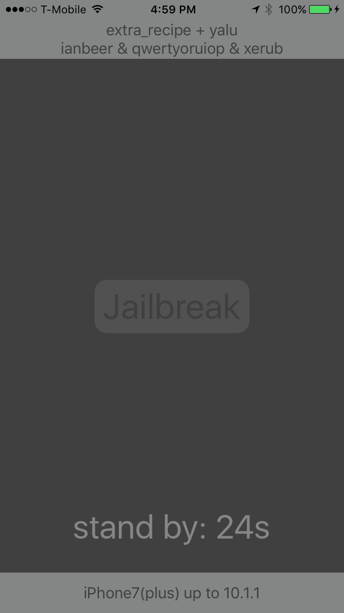
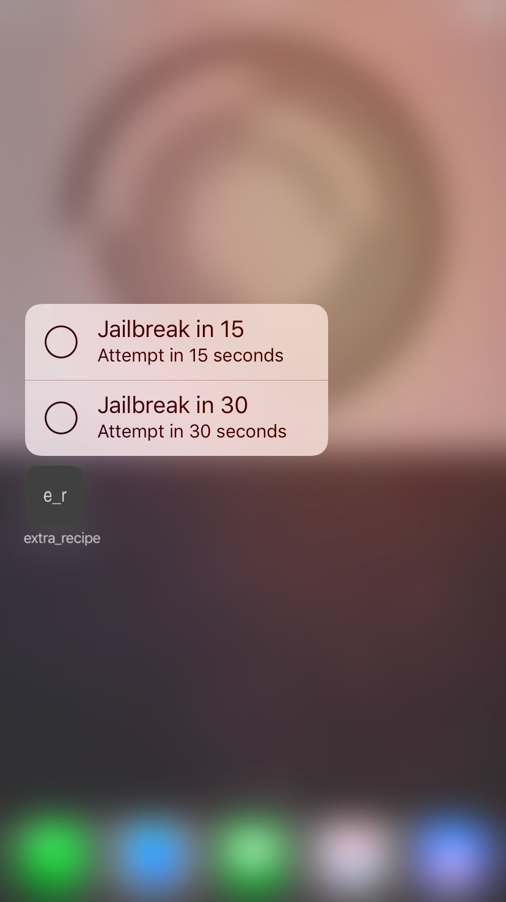

# extra_recipe jailbreak

### Procedure:

1. Clean reboot the device and wait for a couple of minutes.

2. Start extra_recipe, wait for the timer to finish, then hit "jailbreak".

3. Wait for the process to complete

4. If it says "failed, reboot", then reboot the device and start at step 1

   ***Re-trying after a failed attempt without rebooting will most likely result in a kernel panic somewhere down the road***

### Support:

| Device        | Minimum Version | Maximum Version |
| :------------ | :-------------: | :-------------: |
| iPhone 7      |   iOS 10.0.0    |   iOS 10.1.1    |
| iPhone 7 Plus |   iOS 10.0.0    |   iOS 10.1.1    |

### Releases:

|  Version:   |                Download:                 |                  SHA1:                   | Release Notes:                           |
| :---------: | :--------------------------------------: | :--------------------------------------: | ---------------------------------------- |
| dark_1.0.1  | [download](https://github.com/CreatureSurvive/extra_recipe/archive/extra_recipe_dark_v1.0.1.zip) | 668c0656894efa3f8a74d80c6819ee9356e230a9 | [Release Notes](https://github.com/CreatureSurvive/extra_recipe/releases/tag/extra_recipe_dark_v1.0.1) |
|  dark_1.0   | [download](https://github.com/CreatureSurvive/extra_recipe/archive/extra_recipe_dark_v1.0.zip) | 09738af5bfa78332bd404817a87ae15b4c2fc5e5 | [Release Notes](https://github.com/CreatureSurvive/extra_recipe/releases/tag/extra_recipe_dark_v1.0) |
| beta_4_ydia | [download](https://github.com/CreatureSurvive/extra_recipe/archive/beta4cydia.zip) | 2cb22167c2063ff5175e4110301893f2ac367829 | [Release Notes](https://github.com/CreatureSurvive/extra_recipe/releases/tag/beta4cydia) |
|   beta_4    | [download](https://github.com/CreatureSurvive/extra_recipe/archive/beta4.zip) | cf3cb79d67de4cf048584e5a216513ac145dd246 | [Release Notes](https://github.com/CreatureSurvive/extra_recipe/releases/tag/beta4) |

### Screenshots:

|              Main Interface              |                Shortcuts                 |
| :--------------------------------------: | :--------------------------------------: |
|  |  |

### Credits:

* Ian Beer for the amazingly simple, yet awesome, kernel exploit
* @qwertyoruiop for the amazingly complicated, yet effective, memprot bypass
* @CreatureSurvive for not being blinded by the UI
